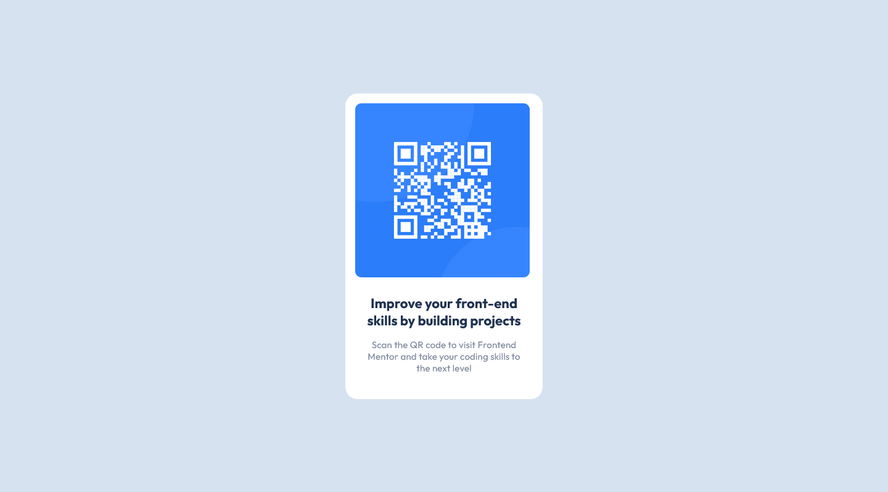

# Frontend Mentor - QR code component solution

This is a solution to the [QR code component challenge on Frontend Mentor](https://www.frontendmentor.io/challenges/qr-code-component-iux_sIO_H). Frontend Mentor challenges help you improve your coding skills by building realistic projects.

## Table of contents

- [Overview](#overview)
  - [Screenshot](#screenshot)
  - [Links](#links)
- [My process](#my-process)
  - [Built with](#built-with)
- [Author](#author)

## Overview

### Screenshot

### Links

- Solution URL: [GitHub](https://github.com/GrzywN/qr-code-component-main)
- Live Site URL: [Netlify](https://main--lively-bunny-63909a.netlify.app/#)

## My process

### Built with

- Semantic HTML5 markup
- SCSS / CSS
- Flexbox / CSS Grid
- Mobile-first workflow

## Author

- GitHub - [GrzywN (Karol Binkowski) · GitHub](https://github.com/GrzywN)
- Frontend Mentor - [@grzywN](https://www.frontendmentor.io/profile/GrzywN)
